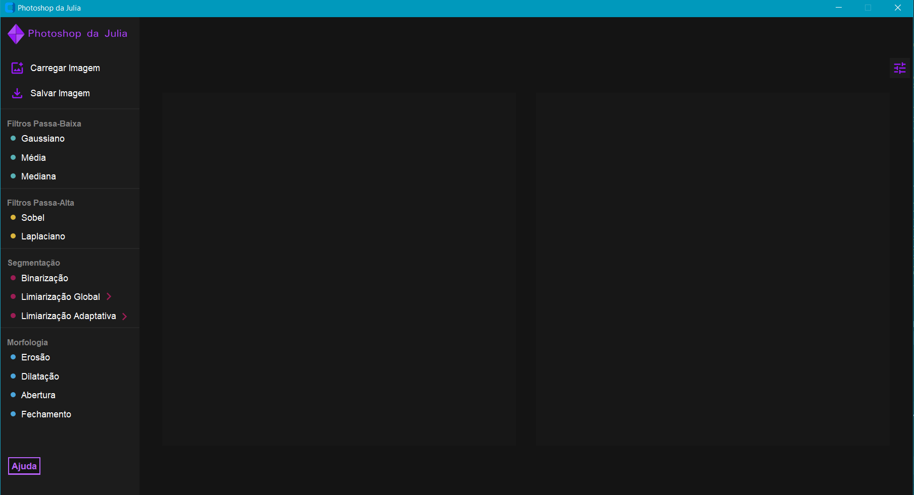
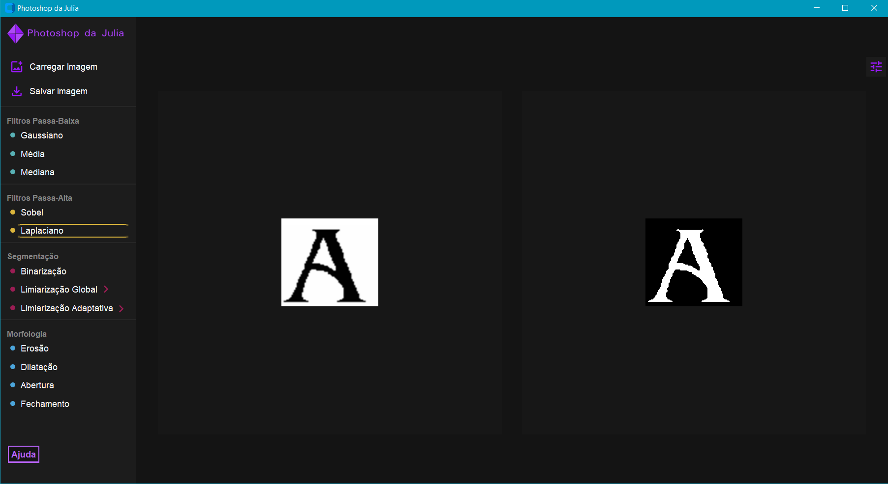
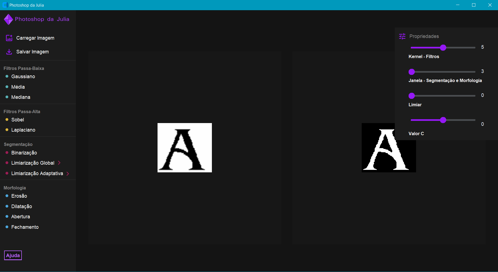

# Photoshop da Julia

Neste trabalho foi implementado um programa editor de imagens para por em prática conhecimentos teóricos da área de processamento de imagens. No editor de imagens, as funcionalidades de carregar, aplicar um filtro,  operação de segmentação, operação de morfologia e salvar a imagem estão disponíveis. Para testar a eficácia da aplicação, imagens com e sem ruído foram manipuladas. O programa se mostrou apto a executar as funcões que foram propostas.

<a href="artigo/Relatorio_Processamento_De_Imagens_Entrega3_JuliaRobaina.pdf">Leia o artigo sobre o programa</a>

## Execução do Programa

O programa deve ser executado a partir do arquivo interface.py presente no diretório novaInterface

## Interface

### Figma
<a>https://www.figma.com/design/oWGHSNoIvGfumt7DKEeUIw/Photoshop-da-Julia</a>

